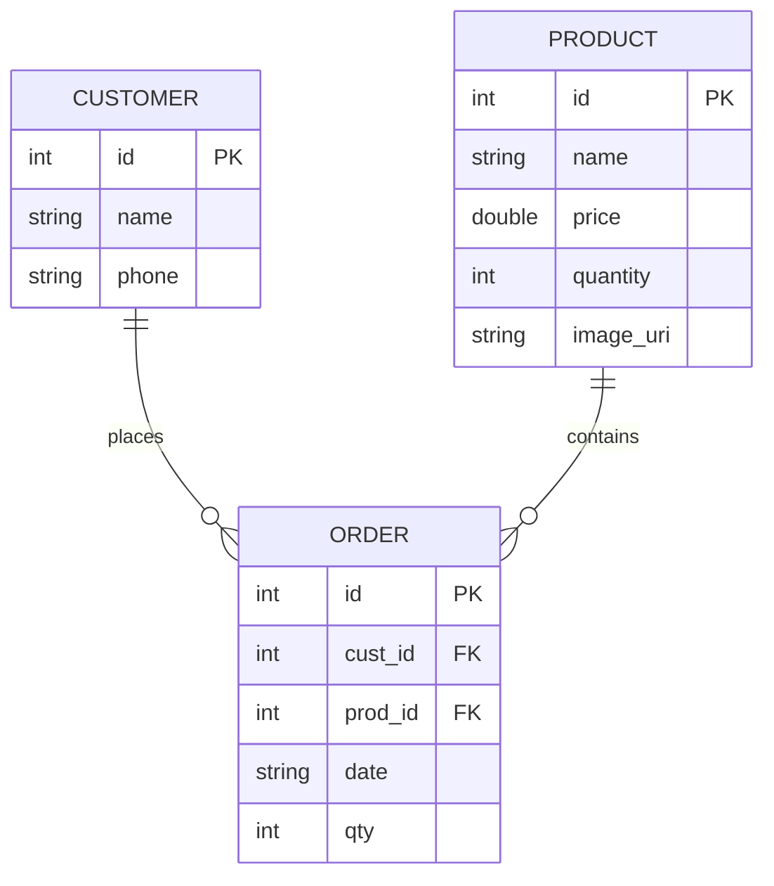

# StockSync - Product Inventory Management System
## Project Documentation (Coursework Submission)

### 1. Introduction
StockSync is a localized retail management application built for Android. The system allows small-to-medium retail businesses to track inventory, manage customer records, and process sales orders with automated stock updates.

### 2. Core Features
- **User Authentication**: A secure entry point requiring valid credentials (demonstration version).
- **Inventory Management**:
    - View all products in a 2-column grid layout.
    - Add new products with name, price, and initial stock quantities.
    - **Image Support**: Attach product photos using the modern Android Photo Picker.
- **Customer Tracking**: Maintain records of periodic buyers.
- **Order Processing**:
    - transactional sale flow: selecting a customer and product to place an order.
    - **Automated Stock Sync**: The system automatically subtracts the purchased quantity from the available inventory in the same transaction.

### 3. Technical Stack
- **Language**: Kotlin (Idiomatic, using data classes and scoping functions).
- **UI Architecture**: XML Layouts with **ViewBinding** for type-safe interaction.
- **Database**: SQLite provided via `SQLiteOpenHelper`.
- **Image Loading**: **Coil-kt** for asynchronous, memory-efficient image rendering.
- **Navigation**: Explicit Intents for moving between activity components.

### 4. Database Schema
The system uses a relational model with three main entities. Data integrity is maintained through foreign key constraints and atomic transactions.

### 5. Implementation Highlights

#### A. Database Transactions
To ensure that an order is never placed without a corresponding stock reduction (and vice versa), the `placeOrder` function uses `beginTransaction()`, `setTransactionSuccessful()`, and `endTransaction()`. This follows the ACID properties of data management.

#### B. Modern Image Handling
The project implements the modern Android Photo Picker (`ActivityResultContracts.PickVisualMedia`). It importantly handles **URI persistence** using `takePersistableUriPermission`, allowing images to remain visible even after the application process is killed or the device is rebooted.

#### C. Grid-based UI
The product list utilizes a `RecyclerView` with a `GridLayoutManager` (span count: 2). Custom adapters bridge the SQLite data models to specialized `MaterialCardView` item layouts.

### 6. Summary of Work
This project demonstrates proficiency in the Android Activity lifecycle, local persistence, UI/UX best practices, and integration of modern third-party libraries (Coil). The code is heavily documented to facilitate ease of grading and project peer-review.
